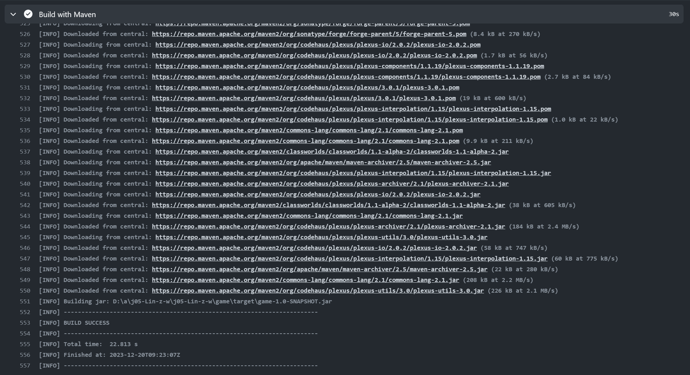
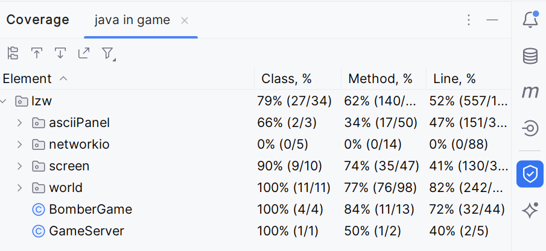
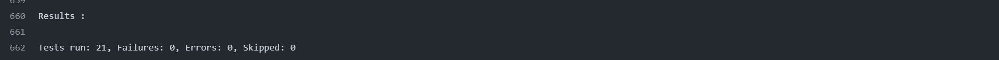

# README

### 基本游戏内容

游戏灵感来自于小时候曾在步步高老人机上游玩过的炸弹人游戏

游戏使用上下左右控制人物移动，使用 `wsad`控制人物在其上下左右放置炸弹，炸弹在闪烁一段时间后会爆炸并消灭其四周两格范围内的生物，并破坏地图，使其变得可以通行，炸弹同时也会对玩家造成伤害，玩家死亡则游戏结束，所有怪物被消灭则游戏胜利。

游戏同时支持多人对战，多人对战需要先启动服务器，然后用户在客户端中才可以加入多人游戏，在对战中不仅需要使用炸弹消灭怪物，还有其他的玩家，以获得最后的胜利。

### Task1: 并发

1. 在程序中实现了并发，总共有三个线程
   - 一个线程是游戏开始运行时的线程
   - 一个线程是控制怪物自动移动的线程，每0.5s使得怪物移动一次
   - 一个线程在单人游戏中用于每0.1s记录一次玩家输入，用于视频回放，在多人游戏中用于每0.1s向服务器发送一次请求更新界面
2. 为了使得两个生物体不会占据同一个物块，我使用了 `occupies` 数组来记录每个地砖的占用情况，并将其设置为 `volatile`，保证每次访问得到的是正确的值
3. 在其他可能发生并发错误的函数上，比如 `Creature`类的 `attack`方法等，我加入 `synchronized`修饰符，确保其在多线程环境下仍能正确运行

演示视频：[jwork05-基本内容展示_哔哩哔哩_bilibili](https://www.bilibili.com/video/BV1n64y1H75X/?vd_source=7070c799944acda3f61d792d05fd67bb)
简介：游戏开始前五秒敌人不会对玩家进行攻击，因为玩家生成位置是随机的，以此防止玩家一进入游戏就死亡，游戏的炸弹可以炸死敌人也可以炸死自己，同时也能破坏除了边界之外的墙砖，该局游戏最后就是被自己的炸弹炸死的。

### Task2: 构建

使用 `maven`实现了对在 `maven repositories`之中的所有第三方库的管理。

项目构架测试等用到的依赖项包括如下内容

```xml
  <dependencies>
    <!-- https://mvnrepository.com/artifact/junit/junit -->
    <dependency>
      <groupId>junit</groupId>
      <artifactId>junit</artifactId>
      <version>4.13.1</version>
      <scope>test</scope>
    </dependency>
  </dependencies>
```

`githubAction`运行结果如下


### Task3: 测试

测试覆盖路如下:


`githubAction`运行结果如下:


### Task4: IO

1. 进度保存：采用将整个游戏类序列化之后保存进入文件，继续游戏只需要直接读取该文件即可
2. 回放：在生成游戏时将游戏类进行序列化保存进入文件，记录他的的初始状态，然后每隔0.1s记录一次玩家的输入，回放时加载游戏的初始状态，再使用 `Robot` 类模拟玩家输入即可
3. 地图保存：考虑到地图保存对于我设计的游戏本身并不是一种合理的设计(地图每次是随机生成的，而且可破坏，而且地图本身对于游戏性并没有太大的影响)，保存地图本身的实现逻辑也和保存游戏进度完全相同，故没有实现

演示视频：[jwork05-回放和保存游戏进度_哔哩哔哩_bilibili](https://www.bilibili.com/video/BV1Ee411B7QK/?vd_source=7070c799944acda3f61d792d05fd67bb)
简介：前50s展示的是回放功能，50s之后展示的是进度保存的功能

### Task5: 网络通信

使用一个服务端实现了多人对战，游戏运行于服务端之上，服务端的网络通信采用了 `Reactor` 架构的 `NIO` 实现。

整体的协议逻辑如下：

1. client 在加入多人游戏时，会向 server 发送一个 `new client` 的消息， server 接收到该消息之后，会给该 client 分配一个 id，然后创建一个该 player 与该 id 绑定，并将其加入到游戏界面中
2. server 在收到 client 发送的消息之后都会向 client 发送一个序列化后的游戏类信息，client 接收到该信息之后反序列化得到游戏类信息，然后直接调用其 display() 函数来显示界面
3. client 每 0.1s 会向 client 发送一个 request 信息，以更新最新的游戏画面。
4. 而当 client 按下按键之后， client 会向 server 发送一个消息 id+keyCode， server 接收到该消息之后根据 id 更新对应的 player 信息，然后同样也会向 client 发送序列化的游戏类信息。

在序列化游戏类并用于网络传输时，客户端在接收到对应的 Object 信息却没有办法正确反序列化得到对应的类，根据网上查阅资料的结果，我将序列化后的结果转化为 String 之后发送到客户端，客户端按照对应方式解码 String 并发序列化得到对应的类（实现于 ObjectRW class）

演示视频：[jwork05-多人对战_哔哩哔哩_bilibili](https://www.bilibili.com/video/BV1mN4y147Vc/?vd_source=7070c799944acda3f61d792d05fd67bb)
简介：支持2人及以上多人对战，需要先开启服务端才能进行连接，多人游戏中被炸弹或者怪物杀死就会断开连接，需要杀死所有怪物和其他玩家才能获得胜利。
